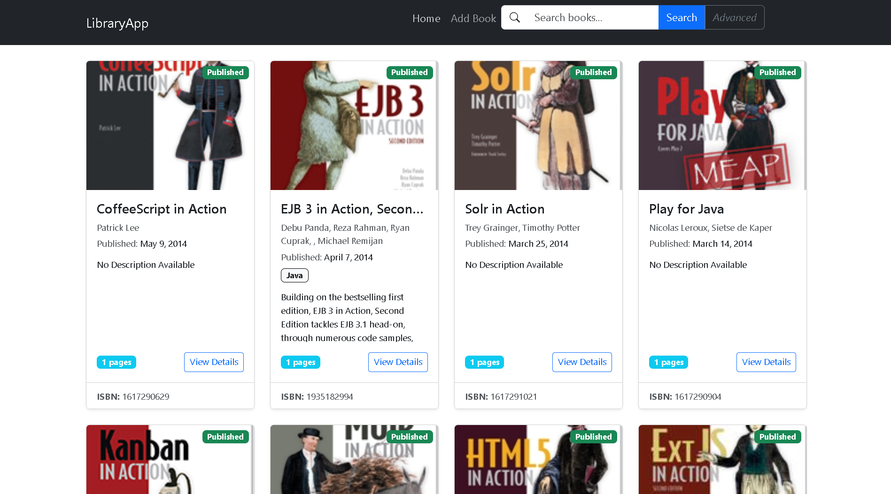
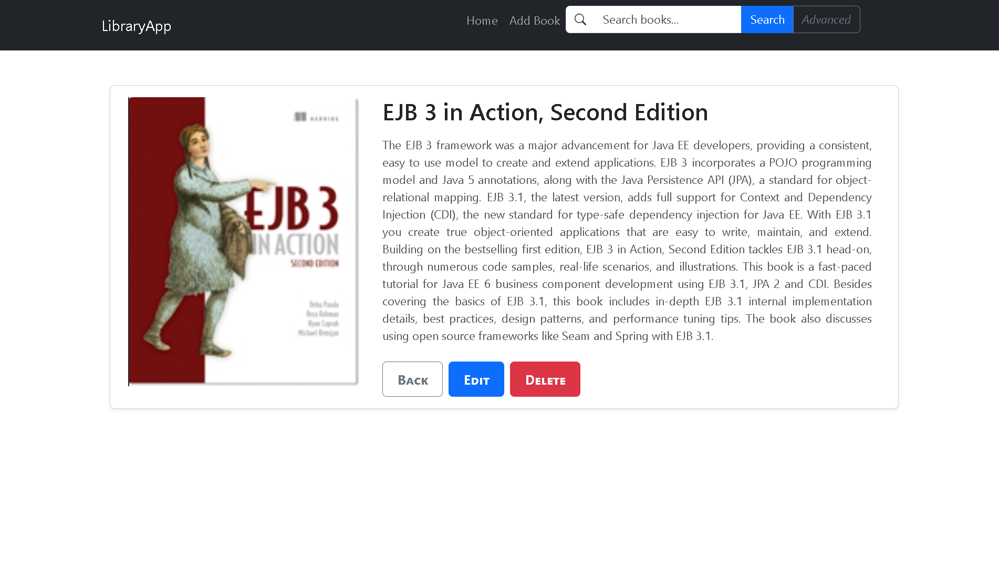
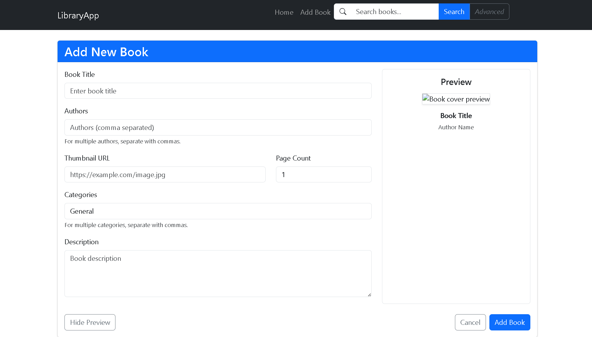
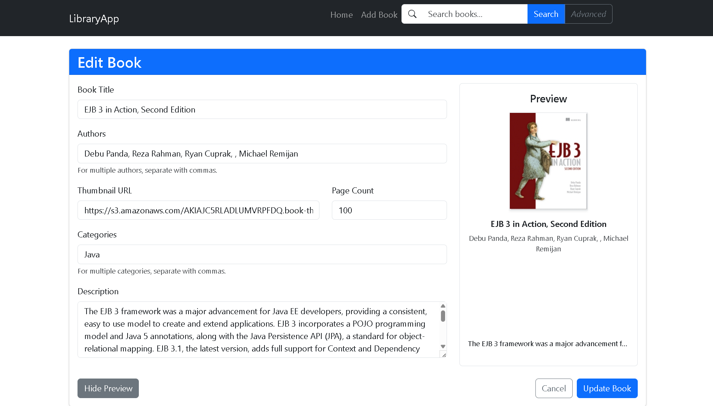
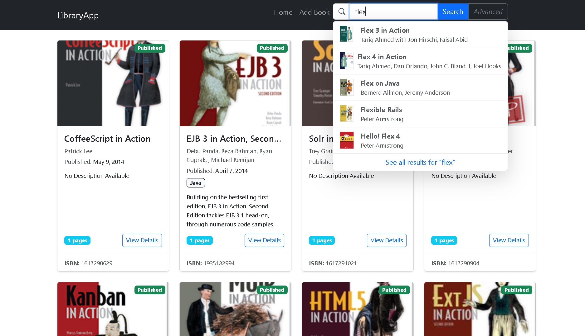
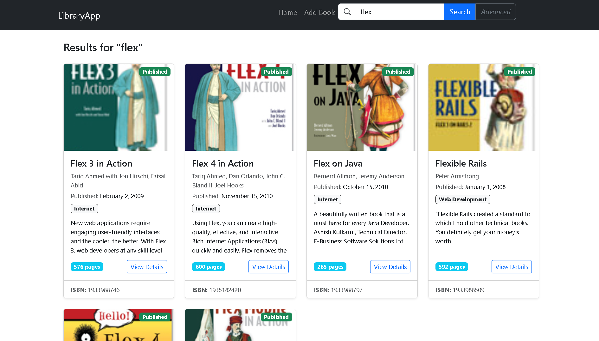
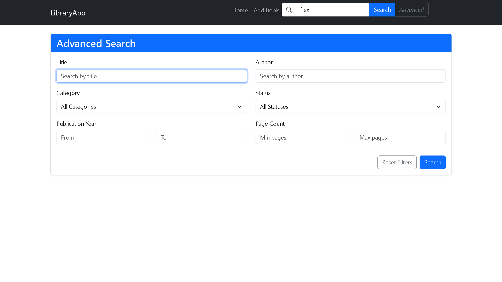

# 📚 LibraryApp

A modern Vite + React + TypeScript frontend web application for managing a digital library of books. Users can perform **CRUD** operations, as well as **global** and **advanced search** without needing to log in.

🔗 **Live Site**: [glibapp.netlify.app](https://glibapp.netlify.app)  
🔗 **Repository**: [GitHub](https://github.com/GiridharanS1729/libraryapp)

---

## 🚀 Features

- 📖 View all books in a responsive card layout.
- 🧾 Add new books via a dynamic form.
- 📝 Edit or delete existing books.
- 🔍 **Global Search** (search all books across fields).
- 🎯 **Advanced Search** with filters (custom fields).
- 📑 Pagination support for navigating large data.
- ❌ No login required – fully accessible.

---

## 🛠️ Tech Stack

| Tech            | Description                            |
|-----------------|----------------------------------------|
| React + TypeScript | Frontend framework and typing system |
| Redux Toolkit   | Global State management for books data  |
| Vite            | Fast build and dev server              |
| SCSS            | Global styles                          |
| Netlify         | Hosting the live web app               |

---

## 📁 Folder Structure

```
library/
├── src/
│   ├── components/         # UI components (BookCard, SearchBar, etc.)
│   ├── pages/              # Pages like Home, AddBook, EditBook
│   ├── redux/              # Redux store and booksSlice
│   ├── ReuseC/             # Reusable buttons (BButton, CButton)
│   ├── assets/             # Static assets
│   ├── global.scss         # App-wide styles
```

---

## 🔧 Setup Instructions

1. Clone the repo  
   ```bash
   git clone https://github.com/GiridharanS1729/libraryapp
   cd libraryapp
   ```

2. Install dependencies  
   ```bash
   npm install
   ```

3. Start the development server  
   ```bash
   npm run dev
   ```

4. Visit [http://localhost:5173](http://localhost:5173) in your browser.

---

## 📸 Screenshots

- Home with Book Cards  

- Book Details  

- Add Book Form  

- Edit Book Form  

- Global Search Bar  


- Advanced Search with Filters


---

## 🙌 Credits

Developed by **[Giridharan S](https://giridharans.vercel.app)**  
Connect on **[LinkedIn](https://linkedin.com/in/giridharans1729)**

---